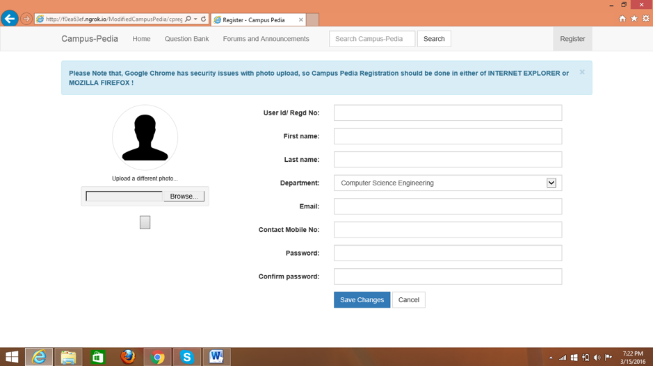
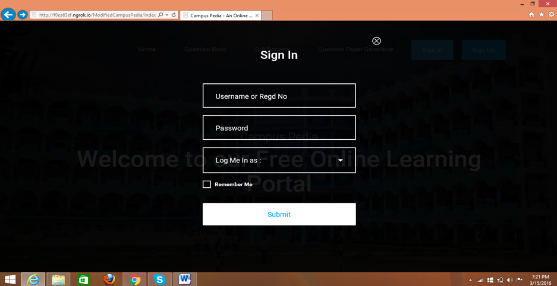
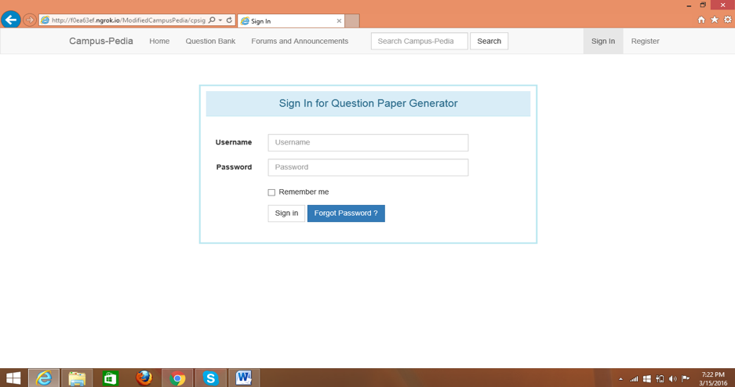
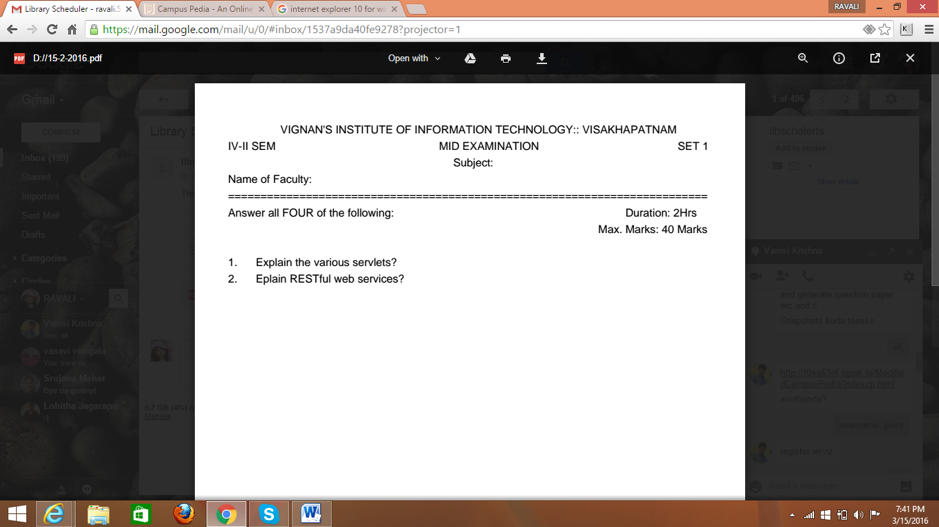

# CampusPedia
Campus Pedia is a web application that serves the needs of the students and faculty and also the exam cell department. It has several modules like Question Bank-which allows the faculty to enter all the set of questions he/she has for a subject and the list of questions along with the answer schema are displayed to the student. It has another module called Automatic Question Paper Generator which generates the question papers in a radomized way using a random algorithm, which benefits the exam cell making their work easy and efficient. It also has another module the Announcement Notifier which communicates to all the registered users through emails via Java Mailing. 

Here are some of the working screenshots of CampusPedia.

